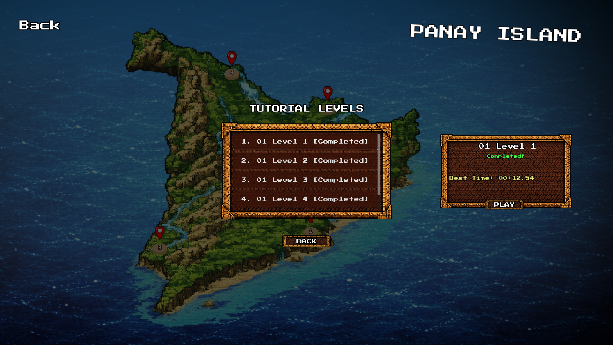

# 🚦 GoCars!

An educational coding-puzzle game built with Godot Engine where players write **real Python code** to control traffic flow and solve increasingly complex transportation puzzles.

**For TrackTech: CSS Hackathon 2026**

---

## 📋 Project Overview

GoCars! bridges the gap between beginner-friendly coding games and real programming. Players write actual Python syntax (not visual blocks) to control vehicles, manage traffic lights, and edit road layouts in real-time. Each puzzle teaches core programming concepts: variables, conditionals, loops, and functions. The immediate feedback from live code execution makes learning intuitive and engaging.

### Core Concept

Write actual Python code to program vehicles, control traffic lights, and manage road layouts. Watch your code execute in real-time as cars navigate, stop at intersections, and reach their destinations. Learn programming fundamentals through hands-on puzzle solving.

---

## ✨ Features & Functionality

### Core Gameplay
- **Real Python Syntax** – Write valid Python code (not visual blocks)
- **Live Execution** – See cars instantly react to your code changes
- **Traffic Simulation** – Dynamic vehicle physics, collisions, and traffic light logic
- **Progressive Difficulty** – 15+ levels introducing new programming concepts
- **Error Feedback** – Learn from mistakes with helpful Python-style error messages
- **Road Building** – Edit maps during gameplay with limited resources (road cards)
- **Hearts System** – Risk-based gameplay with lives/health management

### Interactive Features
- **Real-time Code Editor** – Write and run code without recompilation
- **Multiple Vehicles** – Handle concurrent car logic and interactions
- **Traffic Lights** – Control intersection management with conditional logic
- **Vehicle Stats Display** – Hover to see vehicle type, speed, direction, and state
- **Animated UI** – Heart animations, star ratings, and smooth transitions
- **Campaign Progression** – Save progress and unlock new levels

---

## 🎯 Game Modes

### Campaign Mode
Three progressive level sets teaching Python fundamentals:

- **Tutorial (T1-T5)**: Function calls and sequencing
- **Iloilo City (C1-C5)**: Variables, conditionals, and logic operators
- **Water/Port (W1-W5)**: Loops and iteration

---

## 🚀 Installation & Setup

### Prerequisites

**Required:**
- **Godot Engine 4.5.1** – [Download here](https://godotengine.org/download)
- **Git** (optional, for cloning repository)
- **Python 3.8+** (optional, for running test suite)

### Step 1: Open the Project

**Option A: Using Godot Project Manager**
1. Open Godot Engine
2. Click "Open Project"
3. Navigate to `c:\Users\roman\Desktop\go-cars!`
4. Click "Open"

**Option B: Command Line**
```bash
cd c:\Users\roman\Desktop\go-cars!
godot --path . --editor
```

### Step 2: Project Setup
1. Wait for Godot to load the project (first load takes ~30 seconds)
2. The project is already built and ready to run—no compilation needed
3. Godot automatically imports all assets

### Step 3: Run the Game

**Run in Godot Editor (with visible window):**
```bash
godot --path . --editor
# Then press Play button (F5)
```

**Run Game Directly (without editor):**
```bash
godot --path . --run
```

**Run Tests:**
```bash
./run_tests.sh
```

### Step 4: Build Executable (Optional)

To export as a standalone executable:

1. In Godot Editor: **Project → Export**
2. Click **Add Preset** and select platform:
   - **Windows Desktop** (.exe)
   - **Web** (.html)
   - **macOS** (.dmg)
   - **Linux** (.x86_64)
3. Configure export settings
4. Click **Export** and choose output location

---

## 🛠️ Tech Stack

| Component | Technology | Version |
|-----------|-----------|---------|
| **Game Engine** | Godot | 4.5.1 |
| **Engine Scripting** | GDScript | 3.5 |
| **Player Code** | Python (subset) | 3.9 syntax |
| **Graphics** | 2D Tilemap | Godot native |
| **UI Framework** | Godot Control Nodes | Built-in |
| **Build System** | Godot Editor | Native export |

---

## 🏗️ System Architecture

### Core Systems

```
┌─────────────────────────────────────────┐
│         Main Game Controller            │
│         (main_tilemap.gd)               │
└─────────┬───────────────────────────────┘
          │
    ┌─────┴──────┬────────────┬─────────────┐
    ▼            ▼            ▼             ▼
┌─────────┐  ┌──────────┐  ┌────────┐  ┌─────────┐
│ Python  │  │ Simulation│ │ Level  │  │   UI    │
│ Parser  │  │  Engine   │  │Manager │  │ System  │
│         │  │           │  │        │  │         │
│ • Lexer │  │ • Physics │  │ • Load │  │ • Code  │
│ • AST   │  │ • Collision
│ • Errors│  │ • Traffic │  │ • Spawn│  │ • Hearts│
└────┬────┘  └────┬──────┘  └────┬───┘  └────┬────┘
     │            │             │           │
     └────────────┼─────────────┴───────────┘
                  │
            ┌─────▼──────────┐
            │  Entity System  │
            │  (Vehicles,     │
            │   Stoplights)   │
            └─────────────────┘
```

### Data Flow

1. **Player Input** → Code Editor
2. **Code Parsing** → Python Parser (tokenize + AST)
3. **Execution** → Python Interpreter (line by line)
4. **Commands** → Simulation Engine (vehicle physics, collisions)
5. **State Update** → Entity System (vehicles, stoplights)
6. **Render** → Godot rendering pipeline

---

## 📖 User Guide

### How to Play a Level

1. **Read the objective** at the top of the screen
2. **Write Python code** in the code editor (left side)
3. **Press F5 or "Run Code"** to execute
4. **Watch cars respond** in real-time
5. **Refine your code** and run again until all cars reach destinations

### Example: Level 1 (First Drive)

**Objective:** Make car1 reach its destination

**Python Code:**
```python
car.go()
```

That's it! The car moves forward automatically until it reaches the destination.

### Example: Level 4 (Red Light, Green Light)

**Objective:** Control a traffic light to let the car pass safely

**Python Code:**
```python
stoplight.set_green()
car.go()
```

### Common Commands

**Movement:**
```python
car.go()              # Start moving
car.stop()            # Stop immediately
car.turn("left")      # Turn 90° left
car.turn("right")     # Turn 90° right
car.move(3)           # Move exactly 3 tiles
```

**Sensing:**
```python
if car.front_road():        # Road ahead?
    car.go()
elif car.front_car():       # Another car ahead?
    car.stop()
```

**Traffic Lights:**
```python
if stoplight.is_red():
    car.stop()
else:
    car.go()
```

**Loops:**
```python
while not car.at_end():
    car.go()
```

---

## 🖼️ Screenshots

### Main Menu


### Level Selection


### Gameplay


### Character Dialogue


---

## 🎥 Demo Video

*(Demo video link coming soon)*

See the game in action:
- Real-time code execution
- Multiple vehicles handling
- Traffic light control
- Level progression

---

## 📦 Project Structure

```
GoCars/
├── README.md                      # This file
├── CLAUDE.md                      # Development guide
├── project.godot                  # Godot project config
├── run_tests.sh                   # Test runner script
│
├── scenes/                        # Game scenes
│   ├── main_tilemap.tscn         # Main game scene
│   ├── levelmaps/                # Level scenes (auto-loaded)
│   │   ├── 01Tutorial/
│   │   │   ├── 01 Level 1.tscn
│   │   │   ├── 01 Level 2.tscn
│   │   │   └── ... (15 levels total)
│   ├── ui/                       # UI components
│   │   ├── hearts_ui.tscn       # Lives/hearts display
│   │   ├── completion_summary.tscn
│   │   └── Main_Menu/
│   └── entities/                 # Entity scenes
│
├── scripts/                       # GDScript code
│   ├── core/                     # Core systems
│   │   ├── python_parser.gd     # Python tokenizer & AST
│   │   ├── python_interpreter.gd # Code executor
│   │   ├── simulation_engine.gd  # Physics & collisions
│   │   ├── level_loader.gd      # Level management
│   │   └── level_settings.gd    # Per-level config
│   ├── entities/                 # Game logic
│   │   ├── vehicle.gd           # Car behavior
│   │   ├── stoplight.gd         # Traffic light control
│   │   └── boat.gd              # Boat logic
│   ├── ui/                       # UI logic
│   │   ├── completion_summary.gd
│   │   ├── hearts_ui.gd
│   │   └── toolbar.gd
│   └── map_editor/              # Road building
│       ├── road_tilemap_layer.gd
│       └── road_tile_proxy.gd
│
├── assets/                        # Media files
│   ├── sprites/                 # Vehicle & NPC sprites
│   ├── UI/                      # UI graphics
│   ├── fonts/                   # Custom fonts
│   ├── tiles/                   # Tileset images
│   │   ├── gocarstilesSheet.png (18×12 grid)
│   │   └── road_tileset.tres
│   └── audio/                   # Music & SFX
│
├── data/                         # Data files
│   └── levels/                   # Level configs (JSON)
│       ├── t1.json
│       ├── c1.json
│       └── w1.json
│
├── tests/                        # Test files
│   ├── python_parser.test.gd
│   ├── python_interpreter.test.gd
│   └── simulation_engine.test.gd
│
└── docs/                         # Documentation
    └── PRD.md                   # Product requirements
```

---

## 🎮 Level Editing Guide

### Create a New Level

1. **Copy a template level:**
   ```
   scenes/levelmaps/01Tutorial/01 Level 1.tscn
   ```

2. **Rename it** (e.g., `01 Level 6.tscn`)

3. **Open in Godot Editor** and customize:
   - Edit the TileMap to paint roads and parking spots
   - Set `LevelName` label for display name
   - Configure `HeartsUI/HeartCount` for starting lives (e.g., "3")
   - Position spawn and destination parking tiles

4. **Save** – the level auto-loads into the campaign

### Tileset Layout

The game uses an 18×12 grid tileset with:
- **Basic roads** (connections E/W/N/S)
- **Parking tiles** (spawn/destination groups A-D)
- **Stoplight tiles** (4-way intersections)
- **Multi-parking roads** (parking lot lanes)

---

## 🚧 Known Limitations

### Current Version (Hackathon)
1. **Python Subset** – Not full Python (no classes, imports, list comprehensions)
2. **Single Player** – No multiplayer or competitive modes
3. **Fixed Difficulty** – No difficulty settings or tutorials
4. **Limited Vehicles** – Only 8 vehicle types
5. **No Persistent Save** – Progress resets on game exit (can be added)
6. **Performance** – Max ~20 simultaneous vehicles before slowdown
7. **Audio** – Placeholder sounds only (no professional OST)
8. **Mobile** – Keyboard & mouse only (no touch controls)

### Technical Limitations
- Python parser doesn't support advanced syntax (decorators, async/await)
- Vehicle AI follows pre-calculated paths (limited emergent behavior)
- Stoplight logic is basic (no adaptive traffic control)
- Road tiles must be contiguous (no floating roads)

---

## 🔮 Future Improvements

### High Priority (Post-Hackathon)
- [ ] **Infinite Sandbox Mode** – Unlimited levels with random generation
- [ ] **Function Definitions** – Players can define reusable functions
- [ ] **Better Error Messages** – Line-by-line debugging with highlights
- [ ] **Sound & Music** – Professional OST and sound effects
- [ ] **Leaderboards** – Track best times and star ratings
- [ ] **Tutorial System** – In-game hints and guided walkthroughs

### Medium Priority
- [ ] **Mobile Support** – Touch controls and responsive UI
- [ ] **Advanced Vehicles** – Trucks, buses with different behaviors
- [ ] **Multi-lane Roads** – Parallel roads for more complexity
- [ ] **Parking Lot Puzzles** – Advanced vehicle management scenarios
- [ ] **Save/Load System** – Persistent progress across sessions
- [ ] **Level Editor UI** – Point-and-click level creation in-game

### Lower Priority
- [ ] **Multiplayer** – Cooperative puzzle solving
- [ ] **Social Features** – Share level solutions, community levels
- [ ] **Accessibility** – Colorblind mode, controller support
- [ ] **Platform Exports** – Mobile (iOS/Android), Web
- [ ] **Performance Optimization** – Support 50+ simultaneous vehicles
- [ ] **Advanced Python** – Classes, custom objects, more standard library

---

## 📄 Where This Documentation Lives

### Primary Locations
- **README.md** (this file)
  - Location: `c:\Users\roman\Desktop\go-cars!\README.md`
  - Purpose: Quick overview and setup instructions
  - Audience: New players, developers, judges

- **CLAUDE.md**
  - Location: `c:\Users\roman\Desktop\go-cars!\CLAUDE.md`
  - Purpose: Development guide and API reference
  - Audience: Developers, contributors

- **docs/PRD.md** (Product Requirements Document)
  - Location: `c:\Users\roman\Desktop\go-cars!\docs\PRD.md`
  - Purpose: Complete specification and design doc
  - Audience: Game designers, architects

### Additional Resources
- **In-game Help (F1)** – Context-sensitive help in game
- **Code Comments** – Inline documentation in scripts
- **Example Levels** – Learn by studying tutorial levels (T1-T5)

### Submission Package Contents
- ✅ README.md (quick start)
- ✅ CLAUDE.md (development notes)
- ✅ Source code (all scripts)
- ✅ Executable (when built)
- ✅ Screenshots (main menu, level selector, gameplay, characters)
- ⏳ Demo video (recording in progress)

---

## 📊 System Requirements

### Minimum Specifications
- **OS**: Windows 10, macOS 10.12, Ubuntu 16.04+
- **Processor**: Intel i5 or equivalent
- **RAM**: 2 GB
- **Storage**: 500 MB available space
- **Graphics**: DirectX 11 compatible
- **Input**: Keyboard & mouse required

### Recommended Specifications
- **RAM**: 4 GB or more
- **Graphics**: Dedicated GPU (NVIDIA/AMD)
- **Storage**: SSD for faster load times
- **Monitor**: 1080p or higher resolution
- **Processor**: Intel i7 or equivalent

---

## 👥 Credits

### Development Team

**Programmers:**
- Jake Occeña
- Francis Gabriel Austria
- Carlos John Aristoki

**Design & Art:**
- Jake Occeña
- Jorge Maverick Acidre
- Om Shanti Limpin

**Mentor & Advisor:**
- John Christopher Mateo

### Technologies
Built with ❤️ using:
- [Godot Engine 4.5.1](https://godotengine.org)
- GDScript
- Python (syntax subset)

---

## 📝 License

**GoCars!** is a private submission for **TrackTech: CSS Hackathon 2026**

All rights reserved. © 2026 Development Team

---

## 🤝 Support & Contact

For questions or issues:
1. Check [CLAUDE.md](CLAUDE.md) for development details
2. Review [docs/PRD.md](docs/PRD.md) for specifications
3. Read level comments for gameplay hints

---

**Last Updated:** January 28, 2026
**Version:** 1.0 (Hackathon Submission)
